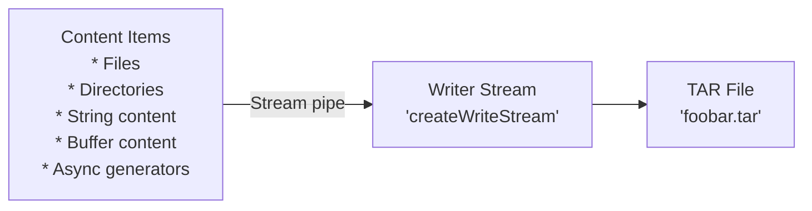

# tar-vern

Streaming tape archiver (tar) library for TypeScript/JavaScript.

[](https://www.repostatus.org/#wip)
[](https://opensource.org/licenses/MIT)
[](https://www.npmjs.com/package/tar-vern)

----

## What is this?

A modern TypeScript library for creating tape archives (tar/ustar format) using streaming API. Supports both files and directories with metadata preservation, GZip compression, readable streaming, and flexible content sources.



## Features

- Streaming API: Memory-efficient processing of large files
- Multiple content sources: String, Buffer, ReadableStream, file paths and async generators
- Metadata preservation: File permissions, ownership, timestamps
- Built-in compression: GZip compression support (`tar.gz` format)
- No any other dependencies.

## Installation

```bash
npm install tar-vern
```

----

## Usage for tar packing

### Basic example

```typescript
import { createTarPacker, storeReaderToFile } from 'tar-vern';

// Create an async generator for tar entries
const generator = async function*() {
  // Add a simple text file
  yield {
    kind: 'file',
    path: 'hello.txt',
    mode: 0o644,
    uname: 'user',
    gname: 'group',
    uid: 1000,
    gid: 1000,
    date: new Date(),
    content: 'Hello, world!'   // text contents
  };
  
  // Add a directory
  yield {
    kind: 'directory',
    path: 'mydir',
    mode: 0o755,
    uname: 'user',
    gname: 'group',
    uid: 1000,
    gid: 1000,
    date: new Date()
  };
};

// Create tar stream and write to file
const packer = createTarPacker(generator());
await storeReaderToFile(packer, 'archive.tar');   // Use helper to awaitable
```

### With GZip compression

Supported `CompressionTypes`:

|`CompressionTypes`|Details|
|:----|:----|
|`none`|Uncompression (default)|
|`gzip`|Combined GZip compression stream|

```typescript
import { createTarPacker, storeReaderToFile, CompressionTypes } from 'tar-vern';

const generator = async function*() {
  yield {
    kind: 'file',
    path: 'data.txt',
    mode: 0o644,
    uname: 'user',
    gname: 'group',
    uid: 1000,
    gid: 1000,
    date: new Date(),
    content: 'Large amount of data...'
  };
};

// Create compressed tar stream
const packer = createTarPacker(generator(), 'gzip');
await storeReaderToFile(packer, 'archive.tar.gz');
```

### Helper functions

```typescript
import { 
  createReadFileItem, 
  createDirectoryItem,
  createReadableItem,
  storeReaderToFile
} from 'tar-vern';
import { createReadStream } from 'fs';

// Configuration easier with item creation functions
const generator = async function*() {
  // Add file from filesystem (auto-detects metadata)
  yield await createReadFileItem('archived-name.txt', '/path/to/real/source.txt');

  // Add directory from filesystem
  yield await createDirectoryItem('dir/sub/name', 'exceptName', { 
    directoryPath: '/path/to/real/dir' 
  });

  // Add from readable stream
  const stream = createReadStream('/path/to/large-file.bin');
  yield await createReadableItem('large-file.bin', stream);
};

// The `packer` generally `stream.Readable`
const packer = createTarPacker(generator());

// Safer awaitable store file from `stream.Readable`
await storeReaderToFile(packer, 'output.tar');
```

### Content types

```typescript
const generator = async function*() {
  // String content
  yield {
    kind: 'file',
    path: 'text.txt',
    content: 'Text content'    // Store with utf8 encoding
    // ... other properties
  };

  // Buffer content
  yield {
    kind: 'file',
    path: 'binary.bin',
    content: Buffer.from([0x48, 0x65, 0x6c, 0x6c, 0x6f])
    // ... other properties
  };

  // Readable stream content
  yield {
    kind: 'file',
    path: 'stream.dat',
    content: {
      kind: 'readable',
      length: 1024,
      readable: myReadableStream
    }
    // ... other properties
  };

  // Async generator content
  yield {
    kind: 'file',
    path: 'generated.dat',
    content: {
      kind: 'generator',
      length: 2048,
      generator: myAsyncGenerator   // (each yielding `Buffer` instance)
    }
    // ... other properties
  };
};
```

### Stat reflection options

```typescript
import { createReadFileItem, ReflectStats } from 'tar-vern';

// Don't reflect any file stats (use provided options only)
yield await createReadFileItem('file.txt', '/source.txt',
  'none', {    // Don't reflect
    mode: 0o644,
    uid: 1000,
    gid: 1000
  });

// Reflect all stats except username/groupname
yield await createReadFileItem('file.txt', '/source.txt',
  'exceptName');   // except names

// Reflect all stats including numeric uid/gid as names
yield await createReadFileItem('file.txt', '/source.txt',
  'all');   // reflect all stats
```

----

## Usage for tar unpacking

TODO:

----

## License

Under MIT.
