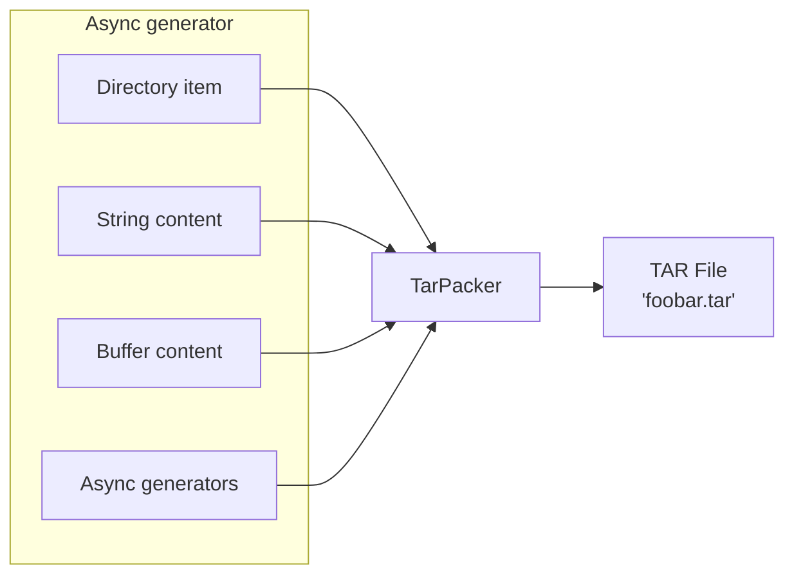
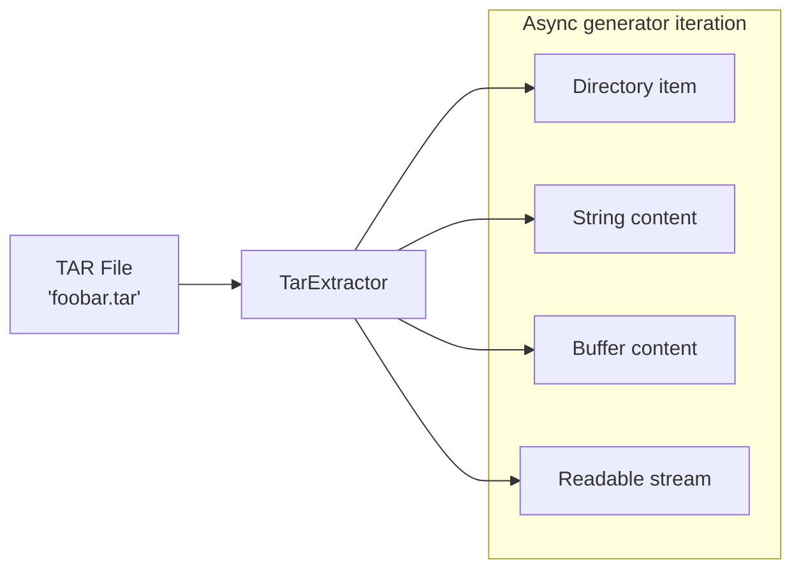

# tar-vern

Streaming tape archiver (tar) library for TypeScript/JavaScript.

[](https://www.repostatus.org/#wip)
[](https://opensource.org/licenses/MIT)
[](https://www.npmjs.com/package/tar-vern)

----

## What is this?

A modern TypeScript library for creating and extracting tape archives (tar/ustar format) using streaming API. Supports both files and directories with metadata preservation, GZip compression, readable streaming, and flexible content sources.

## Packing minimum example

tar-vern supplies file and directory information to pack through "TypeScript async generator."
This allows you to specify pack data with very concise code.



```typescript
import {
  createTarPacker, storeReaderToFile,
  createFileItem, createDirectoryItem } from 'tar-vern';

// Create an async generator for tar entries
const itemGenerator = async function*() {
  // Add a simple text file
  yield await createFileItem(
    'hello.txt',      // file name
    'Hello, world!'   // text contents
  );
  
  // Add a directory
  yield await createDirectoryItem('mydir');

  // (Make your own entries with yield expression...)
};

// Create GZipped tar stream and write to file
const packer = createTarPacker(itemGenerator(), 'gzip');
await storeReaderToFile(packer, 'archive.tar.gz');   // Use helper to awaitable
```

### Extracting minimum example

tar-vern provides tar extraction through async generator, allowing you to process entries as they are extracted from the tar archive.



```typescript
import { createReadStream } from 'fs';
import { createTarExtractor } from 'tar-vern';

// Read GZipped tar file and extract entries
const stream = createReadStream('archive.tar.gz');

for await (const extractedItem of createTarExtractor(stream)) {
  if (extractedItem.kind === 'file') {
    console.log(`File: ${extractedItem.path}`);
    
    // Get content as string, buffer, or readable stream
    const content = await extractedItem.getContent('string');
    console.log(`Content: ${content}`);
  } else {
    console.log(`Directory: ${extractedItem.path}`);
  }
}
```

## Features

- Bidirectional streaming: Both creation and extraction of tar archives
- Memory-efficient: Streaming API for processing large files without buffering
- Multiple content sources: String, Buffer, ReadableStream, file paths and async generators
- Metadata preservation: File permissions, ownership, timestamps
- Built-in compression/decompression: GZip compression support (`tar.gz` format)
- Flexible content access: Extract files as string, Buffer, or Readable stream on demand
- Error handling: Comprehensive validation and error reporting
- Abort signal support: Cancellable operations
- No external dependencies: Pure TypeScript implementation

----

## Installation

```bash
npm install tar-vern
```

## Usage for tar packing

### EntryItem basis

The async generator needs to produce `EntryItem` objects.
These objects hold information about files and directories to be stored in the tar archive, and for files, they also contain content data information.

There are no special requirements for this information, so you can construct everything manually:

```typescript
// Create an async generator for tar entries
const itemGenerator = async function*() {
  // Construct a simple text file item
  yield {
    kind: 'file',
    path: 'hello.txt',
    mode: 0o644,
    uname: 'user',
    gname: 'group',
    uid: 1000,
    gid: 1000,
    date: new Date(),
    content: 'Hello, world!'   // text contents
  } as EntryItem;
  
  // Construct a directory item
  yield {
    kind: 'directory',
    path: 'mydir',
    mode: 0o755,
    uname: 'user',
    gname: 'group',
    uid: 1000,
    gid: 1000,
    date: new Date()
  } as EntryItem;
};
```

However, constructing all `EntryItem` objects manually can be tedious. Therefore, helper functions are provided as follows.

### Helper functions

Helper functions are provided to simplify the construction of `EntryItem` objects. The following types are available:

|Function|Details|
|:----|:----|
|`createDirectoryItem()`|Construct directory item|
|`createFileItem()`|Construct basic file item from string or `Buffer`|
|`createReadableFileItem()`|Construct file item from readable stream (`stream.Readable`)|
|`createGeneratorFileItem()`|Construct file item from async generator|
|`createReadFileItem()`|Construct file item from a file on real filesystem|

For example:

```typescript
import { createReadStream } from 'fs';
import { 
  createReadFileItem, createDirectoryItem,
  createReadableFileItem, storeReaderToFile } from 'tar-vern';

// Configuration easier with item creation functions
const itemGenerator = async function*() {
  // Add file from filesystem (auto-detects metadata)
  yield await createReadFileItem('archived-name.txt', '/path/to/real/source.txt');

  // Add directory from filesystem
  yield await createDirectoryItem('dir/sub/name', 'exceptName', { 
    directoryPath: '/path/to/real/dir' 
  });

  // Add from readable stream
  const stream = createReadStream('/path/to/real/large-file.bin');
  yield await createReadableFileItem('large-file.bin', stream);
};

// The `packer` generally `stream.Readable`
const packer = createTarPacker(itemGenerator());

// Safer awaitable store file from `stream.Readable`
await storeReaderToFile(packer, 'output.tar');
```

NOTE: The tar format requires file sizes to be stored in the header. This means when using `stream.Readable` or async generators for streaming data, the file size must be known in advance. You can provide this via the `length` option in `createReadableFileItem()` and `createGeneratorFileItem()`. However, if `length` is omitted, all data will be buffered in memory before being written to the tar archive, which could cause performance issues with very large files.

### Stat reflection options

When `createReadFileItem()` or `createDirectoryItem()` can access real files or directories, their "stats" metadata can be reflected in the tar archive:

```typescript
import { createReadFileItem, ReflectStats } from 'tar-vern';

// Don't reflect any file stats (use provided `options` parameter)
yield await createReadFileItem('file.txt', '/source.txt',
  'none',   // Don't reflect
  {
    mode: 0o644,   // Mode flags
    uid: 1000,     // user id
    gid: 1000,     // group id
    uname: "foo",  // user name
    gname: "bar"   // group name
  });

// Reflect all stats except user/group name
yield await createReadFileItem('file.txt', '/source.txt',
  'exceptName');   // reflect except names

// Reflect all stats including numeric uid/gid as names
yield await createReadFileItem('file.txt', '/source.txt',
  'all');   // reflect all stats
```

### With GZip compression

Supported `CompressionTypes`:

|`CompressionTypes`|Details|
|:----|:----|
|`none`|Uncompression (default)|
|`gzip`|Combined GZip compression stream|

```typescript
import { createTarPacker, storeReaderToFile } from 'tar-vern';

const itemGenerator = async function*() {
  yield await createFileItem(
    'data.txt',
    'Large amount of data...'
  );
};

// Create uncompressed tar stream
const packer = createTarPacker(itemGenerator(), 'none');
await storeReaderToFile(packer, 'archive.tar');
```

----

## Usage for tar extracting

### ExtractedEntryItem basis

The extractor yields `ExtractedEntryItem` objects that represent files and directories in the tar archive. For files, you can access the content using the `getContent()` method:

```typescript
// Process each extracted entry
for await (const item of createTarExtractor(stream)) {
  console.log(`${item.kind}: ${item.path}`);
  console.log(`Mode: ${item.mode.toString(8)}`);
  console.log(`Owner: ${item.uname}:${item.gname} (${item.uid}:${item.gid})`);
  console.log(`Date: ${item.date}`);
  
  if (item.kind === 'file') {
    // Get content as string
    const textContent = await item.getContent('string');
    
    // Or get content as Buffer
    const binaryContent = await item.getContent('buffer');
    
    // Or get content as Readable stream
    const streamContent = await item.getContent('readable');
    // Process stream: for await (const chunk of streamContent) { ... }
  }
}
```

### With GZip decompression

Support for gzip-compressed tar files (`.tar.gz` or `.tgz`):

```typescript
import { createReadStream } from 'fs';
import { createTarExtractor } from 'tar-vern';

// Extract from compressed tar file
const stream = createReadStream('archive.tar.gz');

for await (const item of createTarExtractor(stream, 'gzip')) {
  console.log(`Extracted: ${item.path}`);
  
  if (item.kind === 'file') {
    // For large files, use readable stream to avoid memory issues
    const stream = await item.getContent('readable');
    
    // Process content incrementally
    for await (const chunk of stream) {
      // Process each chunk without loading entire file into memory
      console.log(`Processing chunk of ${chunk.length} bytes`);
    }
  }
}
```

### Error handling

The extractor validates tar format and throws appropriate errors:

```typescript
try {
  for await (const item of createTarExtractor(stream)) {
    // Process items...
  }
} catch (error) {
  if (error.message.includes('Invalid tar format')) {
    console.error('Not a valid tar file');
  } else if (error.message.includes('Invalid checksum')) {
    console.error('Corrupted tar file');
  } else {
    console.error('Extraction error:', error.message);
  }
}
```

----

## Abort signal support

You can cancel extraction using AbortSignal:

```typescript
const controller = new AbortController();

// Cancel after 5 seconds
setTimeout(() => controller.abort(), 5000);

try {
  for await (const item of createTarExtractor(stream, 'none', controller.signal)) {
    // Process items...
  }
} catch (error) {
  if (error.name === 'AbortError') {
    console.log('Extraction cancelled');
  }
}
```

----

## License

Under MIT.
